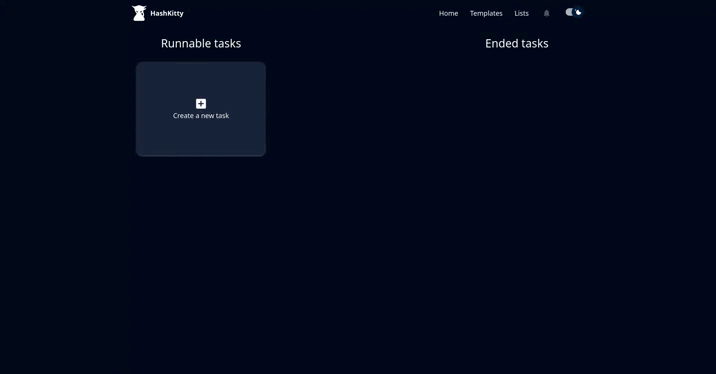

# [Hashkitty](https://github.com/ScriptSathi/HashKitty)


Hashkitty is another web user interface for Hashcat, fully written in Typescript.



## Disclaimer

The project is currently in **Alpha Version**. It may encounter bugs or any weird behaviours. If you notice any, please submit an issue with as much details as possible.

## Prerequisites

- `Hashcat v6.2.6 or later` 
- `Docker Compose`

## Install

### Docker

If you want to deploy this project with Docker, please check the [Docker install](DOCKER.md)

### Standalone install

If you just want to install it in local for testing, you need to have a mysql server deployed. You can use the database below to do so.

```
cd deploy-dev
docker-compose up -d
```

Now, compile the front-end for producton environnement and start it

```
cd hashkitty-front
npm ci
npm run build
npm run preview
```

Then compile the api and start it

```
cd hashkitty-server
npm ci
npm run compile
node build/src/index.js
```
